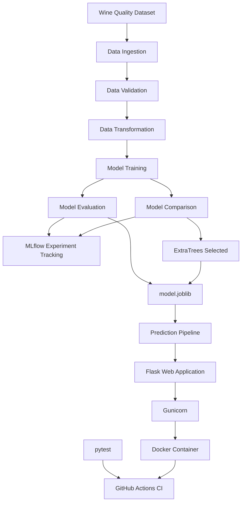

# WineMetric

### An End-to-End Machine Learning Pipeline for Predicting Wine Quality

WineMetric is an end-to-end machine learning project that predicts red wine quality from physicochemical laboratory measurements.

The project demonstrates a complete production-oriented machine learning workflow including data ingestion, validation, transformation, model training, model comparison, MLflow experiment tracking, automated testing, Flask-based prediction, Docker containerization, and GitHub Actions CI.

> **From lab sheet to quality score — before the bottle is filled.**

---

## Project Overview

Wine quality evaluation traditionally depends heavily on human sensory assessment. Although expert tasting remains important, physicochemical laboratory measurements can provide an earlier and more objective indication of wine quality.

WineMetric uses laboratory chemistry measurements to predict a wine quality score.

The pipeline:

1. Downloads the wine quality dataset
2. Validates the incoming schema
3. Splits the data into training and testing sets
4. Trains machine learning models
5. Evaluates model performance
6. Tracks experiments with MLflow
7. Selects a stronger production model
8. Saves the trained model
9. Serves predictions through Flask
10. Packages the application with Docker
11. Runs automated tests and CI through GitHub Actions

---

# Architecture



---

# Machine Learning Pipeline

## 1. Data Ingestion

The ingestion stage downloads and extracts the wine quality dataset.

Output:

```text
artifacts/data_ingestion/
├── data.zip
└── winequality-red.csv
```

---

## 2. Data Validation

The validation stage checks whether the incoming dataset contains the expected features defined in:

```text
schema.yaml
```

Validation results are written to:

```text
artifacts/data_validation/status.txt
```

The pipeline stops if the required schema is not satisfied.

---

## 3. Data Transformation

The dataset is split into training and testing sets using a reproducible random seed.

Current split:

```text
Training samples: 1279
Testing samples:   320
```

Generated files:

```text
artifacts/data_transformation/train.csv
artifacts/data_transformation/test.csv
```

---

## 4. Model Training

WineMetric initially used **ElasticNet Regression** as the baseline model.

After model comparison, **Extra Trees Regression** produced significantly better evaluation results and was promoted to the production model.

The trained model is saved as:

```text
artifacts/model_trainer/model.joblib
```

---

# Model Performance

## Production Model

**ExtraTreesRegressor**

| Metric | Score |
|---|---:|
| RMSE | 0.5400 |
| MAE | 0.3871 |
| R² | 0.5537 |

### Baseline ElasticNet

| Metric | Score |
|---|---:|
| RMSE | 0.6929 |
| MAE | 0.5544 |
| R² | 0.2653 |

The Extra Trees model substantially improved predictive performance compared with the original ElasticNet baseline.

---

# Dataset

WineMetric uses the **Wine Quality – Red Wine** dataset from the UCI Machine Learning Repository.

Dataset characteristics:

- **1,599 observations**
- **11 input features**
- **1 target variable**
- Target: `quality`

### Input Features

1. Fixed acidity
2. Volatile acidity
3. Citric acid
4. Residual sugar
5. Chlorides
6. Free sulfur dioxide
7. Total sulfur dioxide
8. Density
9. pH
10. Sulphates
11. Alcohol

---

# MLflow Experiment Tracking

WineMetric integrates **MLflow** for experiment tracking.

Each model run can track:

- model parameters
- RMSE
- MAE
- R²
- trained model artifacts

Experiments include:

```text
WineMetric
WineMetric-Model-Comparison
```

Start the local MLflow server with:

```bash
mlflow server --host 127.0.0.1 --port 5000 --workers 1
```

Then open:

```text
http://127.0.0.1:5000
```

---

# Model Comparison

WineMetric does not rely on the first model that was trained.

Multiple regression algorithms were evaluated and tracked using MLflow.

The comparison process included models such as:

- ElasticNet
- Random Forest
- Gradient Boosting
- Extra Trees

Extra Trees achieved the strongest evaluation result during the comparison and was promoted to the production pipeline.

---

# Prediction Pipeline

The prediction pipeline loads the trained model and validates incoming features before prediction.

It checks for:

- missing features
- unexpected features
- non-numeric values
- correct feature ordering

Example:

```python
from mlProject.pipeline.prediction import PredictionPipeline

features = {
    "fixed acidity": 7.4,
    "volatile acidity": 0.70,
    "citric acid": 0.00,
    "residual sugar": 1.9,
    "chlorides": 0.076,
    "free sulfur dioxide": 11.0,
    "total sulfur dioxide": 34.0,
    "density": 0.9978,
    "pH": 3.51,
    "sulphates": 0.56,
    "alcohol": 9.4,
}

pipeline = PredictionPipeline()

prediction = pipeline.predict(features)

print(prediction)
```

---

# Flask Web Application

WineMetric provides a browser-based prediction interface using Flask.

Users can enter all 11 wine chemistry measurements and receive a predicted wine quality score.

Run locally:

```bash
python app.py
```

Then open:

```text
http://127.0.0.1:8080
```

Example prediction from the current Extra Trees production model:

```text
Predicted Wine Quality: 5.0
```

---

# Automated Testing

WineMetric uses **pytest** for automated testing.

The current test suite covers:

### Prediction tests

- valid prediction
- missing feature validation
- unexpected feature validation
- non-numeric input validation

### Flask tests

- home page response
- valid prediction request
- invalid prediction input handling

Run all tests:

```bash
pytest -v
```

Current result:

```text
7 passed
```

---

# Continuous Integration

WineMetric uses **GitHub Actions**.

The CI workflow runs automatically for pushes and pull requests to the `main` branch.

The workflow performs:

```text
Checkout repository
        ↓
Set up Python 3.12
        ↓
Install dependencies
        ↓
Install WineMetric
        ↓
Verify imports
        ↓
Run training pipeline
        ↓
Run pytest
        ↓
Build Docker image
        ↓
CI Passed
```

Workflow configuration:

```text
.github/workflows/ci.yml
```

---

# Docker

WineMetric can run inside a Docker container.

## Build the image

```bash
docker build -t winemetric:1.0 .
```

## Run the container

```bash
docker run --rm --name winemetric-app -p 8080:8080 winemetric:1.0
```

Then open:

```text
http://localhost:8080
```

The Docker container uses:

- Python 3.12
- Flask
- Gunicorn
- non-root application user
- Extra Trees production model

---

# Run the Complete Training Pipeline

Run:

```bash
python main.py
```

Pipeline sequence:

```text
Data Ingestion
      ↓
Data Validation
      ↓
Data Transformation
      ↓
Model Training
      ↓
Model Evaluation
      ↓
MLflow Tracking
```

A successful run finishes with:

```text
WineMetric pipeline completed successfully
```

---

# Project Structure

```text
End-to-end-ML-Project-with-MLFlow/
│
├── .github/
│   └── workflows/
│       └── ci.yml
│
├── artifacts/
│   ├── data_ingestion/
│   ├── data_validation/
│   ├── data_transformation/
│   ├── model_trainer/
│   └── model_evaluation/
│
├── config/
│   └── config.yaml
│
├── src/
│   └── mlProject/
│       ├── components/
│       ├── config/
│       ├── constants/
│       ├── entity/
│       ├── pipeline/
│       └── utils/
│
├── templates/
│   └── index.html
│
├── tests/
│   ├── test_flask_app.py
│   └── test_prediction.py
│
├── .dockerignore
├── .gitignore
├── app.py
├── Dockerfile
├── main.py
├── params.yaml
├── pytest.ini
├── requirements.txt
├── schema.yaml
└── setup.py
```

---

# Configuration

WineMetric separates configuration from application code.

## `config/config.yaml`

Contains artifact locations and pipeline configuration.

## `params.yaml`

Contains production model hyperparameters.

Example:

```yaml
ExtraTrees:
  n_estimators: 200
  random_state: 42
  n_jobs: -1
```

## `schema.yaml`

Defines expected dataset columns and target variable.

---

# Technologies

### Machine Learning

- Python
- scikit-learn
- Extra Trees Regression
- MLflow

### Data Processing

- Pandas
- NumPy

### Configuration & Serialization

- PyYAML
- Joblib
- python-box

### Web Application

- Flask
- Gunicorn
- HTML/CSS

### Testing

- pytest

### DevOps

- Docker
- GitHub Actions
- Git
- GitHub

---

# Reproducibility

The project is designed so a clean CI environment can:

1. clone the repository
2. install dependencies
3. download the dataset
4. validate the dataset
5. train the model
6. evaluate the model
7. create the model artifact
8. run automated tests
9. build the Docker image

The trained model therefore does not need to be manually committed to Git.

---

# Security Considerations

The project follows several basic secure-development practices:

- environment files are excluded from Git
- generated artifacts are excluded from version control
- Docker runs the application as a non-root user
- Flask debug mode is not used as the production container server
- Gunicorn serves the production container
- GitHub Actions receives read-only repository content permission
- secrets should be supplied using environment variables or GitHub Secrets

---

# Future Improvements

Possible future extensions include:

- hyperparameter tuning
- additional model comparison
- feature importance visualization
- model registry integration
- cloud deployment
- model monitoring
- prediction drift monitoring
- REST API endpoint
- additional integration tests

---

# Reference

Cortez, P., Cerdeira, A., Almeida, F., Matos, T., & Reis, J. (2009).  
*Modeling wine preferences by data mining from physicochemical properties.*  
Decision Support Systems, 47(4), 547–553.

Dataset: UCI Machine Learning Repository — Wine Quality Dataset.

---

# Capstone

**SAIT — Data Analytics**

**Tech CapCon Spring 2026**

### Team Members

- Sharndeep Kaur
- Sajid Bapu
- Harpreet Kaur
- Rakhsha Varu

### Supervisor

**Tee Wijesooriya**

---

## License

This project was developed for academic and educational purposes as part of the SAIT Data Analytics Capstone Project.